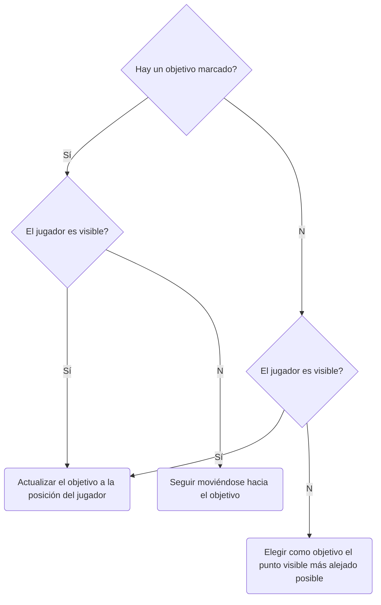

# El ataque ede los bolorojos 

## Hitos de programación
- Generación de mapa procedural: Se ha programado un script capaz de generar
laberintos de forma procedural sujeto a los ajustes descritos en una serie 
de parámetros públicos. Ofrece las siguientes características:

	- Ajuste de tamaño total y de salas en *x* y *z*: Tanto la amplitud del mapa
	como el área mínima de las salas generadas es ajustables.

	- Uso de vector de prefabas para la construcción:  Siempre y cuando 
	todos los prefabs destinados a representar muros tengan forma 
	cuadrada y el mismo tamaño, se pueden añadir cuantos prefabs se 
	quieran para dar mayor variedad a los mapas.

	- Instanciación automática de elementos interactivos: El sistema 
	consiste en dos vectores públicos, uno de prefabs y otro de números
	reales que representan la probabilidad de instanciación del prefab 
	de mismo índice.

Estos puntos han permitido simplificar la creación de los mapas y sus elementos

- Optimización del laberinto: Dado que el objetivo del juego es el de 
ser ejecutado en un dispositivo móvil, hemos tenido presente las limitaciones
que estos poseen a fin de obtener el mejor rendimiento posible. De esta forma,
a pesar de que las paredes del laberinto son copias de elementos de dimensión
x=1 y z=1, estos no poseen box colliders asociados, sino que se generan aparte
como prismas rectangulares que tratan de contenter el mayor área posible.
Como resultado se consigue que los objetos relacionados con los cálculos de físicas
y navegación sean mínimos.

 -  	

- Adición de capacidad de manipulación de objetos físicos al jugador: Tal 
y como sugiere el nombre, el personaje del juego tiene la capacidad de
interaccionar con objetos con componentes rigidbody no solo de formas 
triviales como colisiones sino pudiendo "agarrarlo" y transportarlos 
consigo. Esto ha sido conseguido mediante el uso de **joints** y **raycasts**.

- Uso de una IA no trivial: Se ha intentado dotar a los agentes 
que actúan como enemigos de un patrón de comportamiento con un cierto 
grado de realismo. Estos no se mueven aleatoriamente por el mapa o, 
por el contrario, conocen en todo momento la posición del jugador. Sino 
que se rigen por las siguientes reglas.

- Con esto se consigue que el agente siga al jugador siemrpe que lo pueda ver y 
en caso de perderlo de vista se mueva hasta la última posición conocida en la 
que estuvo, una vez allí podrá darse el caso de que vuelva a verlo de nuevo
(pues lo ha estado siguiendo) y continue el proceso o que definitivamente le 
haya perdido la pista, en cuyo caso tratará de desplazarse por el laberinto 
"patrullando". 

- Uso de dos tipos de enemigos diferenciados:

	1. Dron kamikaze: Vuela a alta velocidad por el mapa tratando de encontrar
	al jugador. En caso de acerlo trataŕa de chocar para inmolarse, generarndo
	una explosión que provoca una gran cantidad de daño.

	2. Robot cuadrúpedo: Se desplaza con mayor lentitud por tierra firme y necesita 
	orientarse hacia el jugador para poder dispararle. Tratará de mantener 
	las distancias dado que su forma de ataque no requiere contacto.

Esta comprobación con una fracuencia determinada en una `corutina` en lugar
de a cada frame en la función `Upadate()` pensando en las limitaciones 
anteriormente mencionadas. 

- Capacidad de disparo por parte del jugador: Sujeta a una cantidad de munición
finita que peude ser recargada mediante objetos recogibles en el mapa.

- 

### Acuerdo
Antes de abordar el reparto de tareas como tal, debemos comentar algunas 
restricciones y problemas a los que tuvimos que enfrentarnos.

## Restricciones
- Tiempo.
- Soporte de Unity en Linux: La versión actual del editor de Unity para GNU/Linux
no permite la exportación a cualquier plataforma diferente al propio sistema
anfitrión. Así mismo, no permitía emular los sensores requeridos por la 
realdiad virtual, lo que imposibilitaba el testeo de uno de los miembros.

## Metodología
Debido a esto, decidimos emplear una estrategia que nos permitiera iteraciones 
rápidas en paralelo para que ambos miembros pudieran testear los avances.
La solución fue la creación de dos escenas simétricas, una de las cuales
emplearía realidad virtual mientras la otra usaría el prerfab de fps. Además 
de eso, establecimos las siguientes reglas:

- Ningún objeto sería colocado manualmente en el mapa y la generación de 
todos los elementos estaría guiada por scripts y parámetros en los prefabs.
Conseguiríamos que todos los cambios ocurriesen en ambas escenas a la par.

- No se usaría ningún prefab hasta haber terminado la lógica del juego, y
estos se utilizarían como elementos anidados a nuestros propios prefab.
Evitamos así tener que readaptar en exceso los scripts una vez se decidieran
añadir los elementos artísticos así como mantener el proyecto muy ligero
(commits y pulls más rápidos) además de impedir la fijación en los detalles. 

- Daniel:
	- Creación del sistema generador de mapas y sus optimizaciones asociadas
	- Programación y testeo de la lógica de los enemigos 
	- Creación del sistema de físicas
	- Creación del game controller
	- Búsqueda de prefabs y arte
- Norberto
	- Creación de los objetos recogibles del mapa 
	- Creación del sistema de disparos de jugador y enemigos
	- Implementación de la realidad virtual.
	- Creación de las build de android.
	- Búsqueda de prefabs y arte

